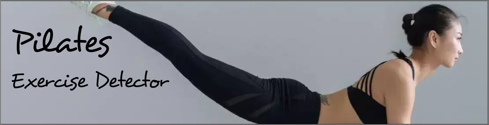

 
# Pilates Video Classification
Deep learning network that uses transfer learning via VGG16 to classify between 3 different pilates exrecies

# Inference

The inference is done using a Flask app. The code is hosted here: https://github.com/zemmyang/itc_pilates_detection_inference
